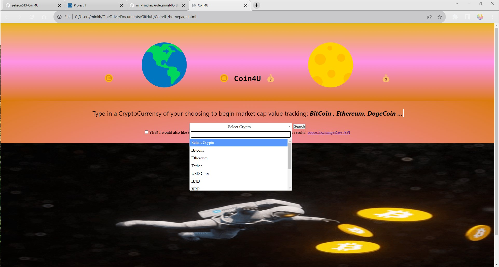
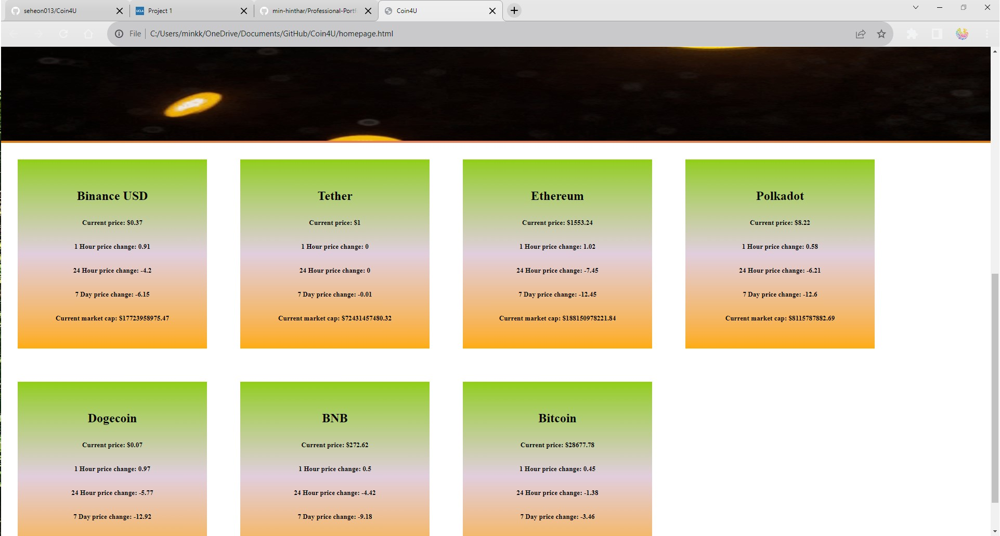

# Coin4U

Coin4U is a front-end application with live web-APIs designed for users to get access to the latest market values of cryptocurries and currency exchange rates. As a user who has vested interest in knowing the most up-to-date cryptocurrency and currency exchange rates marketcap and price change by the hour/day, when the user selects a currency from the dropdown menubox or type into the searchbox and click on the search button, the user selected currency name and its corresponding market values will be displayed prepended in the main section below.

Group Presentation: https://docs.google.com/presentation/d/1Esmynkus2TEuheM_HYU3SmGKoXxXcIc2/edit?usp=sharing&ouid=102654571422236759853&rtpof=true&sd=true

GitHub repo: https://github.com/seheon013/Coin4U

Resources:

CoinMarketCap API: https://coinmarketcap.com/api/

Exchange Rate API: https://v6.exchangerate-api.com/v6/de9b9fda136b7ee1b28581d7/latest/USD

Bulma

JQuery

CSS

HTML5

JavaScript

GitHub

Contacts:

https://github.com/aleenaalexia

https://github.com/seheon013

https://github.com/min-hinthar

